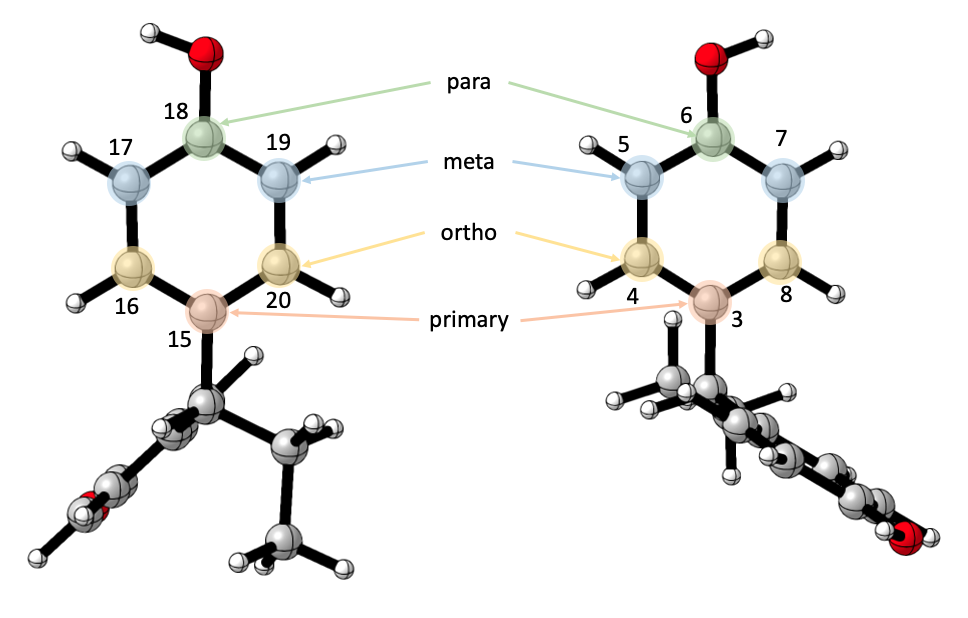

# Command Line Usgae - Guide
This guide will demonstrate the use of moleculaR's stand-alone functionalities. 

Note that there are some additional features that were not included in `moleculaR()` and are only available with interactive use. 

```
# Load moleculaR
library(moleculaR)
```

>**All functions (but `steRimol.xyz` functions) require users to set the working directory to _moleculaR_csv_files_**

**Throughout the text, command-line usage will be regarded as CLU**

**Generally - CLU functions have suffixes .df and .multi:**
  
  **.df functions return data frames with wanted information**
  
  **.multi functions are vectorized versions of .df functions, applied to more than one input.**
  
**If there's any logic to a having a .multi function it will be there, but when there isn't, it won't.**
  
  

## steRimol

See `Features - Definitions and Practice` for a detailed definition of sterimol features.
 
moleculaR's sterimol implementation for the calculation of sterimol values based on xyz structures. 

There are two distinct versions of steRimol, which depend on the task users wish to perform:
  
  1. `steRimol.df()` and `steRimol.multi()` - operate on moleculaR's csv files

This is the working function behind `moleculaR()` and the preferred function of use, as the rest of the package functions demand having the working directory set to _moleculaR_csv_files_.   

  2. `steRimol.xyz.df()` and `steRimol.xyz.multi()` - operate directly on xyz files 

Due to popular usage of sterimol values and the fact that the optimized structure is all it requires, this function allows users to have them calculated fast from any given xyz file. 

CLU for both cases is identical, and depends solely on the type of files you have in your current working directory.

#### TL;DR

```
#Classic Use - for primary axis 1-2 use:

steRimol.multi('1 2') # for moleculaR's csv files

steRimol.xyz.multi('1 2') # for a set of xyz files

#For more than one primary axis, say 1-2 and 1-3, use:

steRimol.multi(c('1 2', '1 3')) # for moleculaR's csv files

steRimol.xyz.multi(c('1 2', '1 3')) # for a set of xyz files

#See documentation - in R console:
?steRimol.multi()
?sterimol.xyz.multi()
```

#### Function Structure

The structure of `steRimol.multi()` is presented, but is identical to that of `steRimol.xyz.multi()`
```
sterimol.multi(coordinates_vector,
                CPK = F,
                only_sub = T,
                drop = NULL)
```

CPK, only_sub and drop all have default values, which allow immediate use with only primary axis supplied by users. 

##### Arguments:

  **coordinates_vector:** 
  
  An R vector of strings. Each string denotes a primary axis, with the structure 'atom1 atom2', where the 3D vector of atom1 to atom2 will         define sterimol's primary axis. 
  
  The function expects at least one primary axis, when only one primary axis is wanted, user defines it with the argument:
  
  `'atom1 atom2'`
  
  To use multiple axes, user defines the set of axes by the argument:
  
  `c('atom1 atom2', 'atom3 atom4')`
  
  For example: 
  1. say a user wants to compute sterimol values for axis 1-2
  
  ```
  # explicitly 
  sterimol.multi(coordinates_vector = '1 2')
  
  # implicitly 
  sterimol.multi('1 2')
  ```

    
  2. say a user wants to compute sterimol values for axes 1-2 and 1-3
  
  ```
  # explicitly 
  sterimol.multi(coordinates_vector = c('1 2', '1 3'))
  
  # implicitly 
  sterimol.multi(c('1 2', '1 3'))
  ```

  **CPK:**
  
  Users can avoid default use of Pyykko's covalent radii and apply CPK values by setting `CPK = T`.
  
  
  For example:
  
  say a user wants to compute sterimol values for axes 1-2 and 1-3, with CPK values
  
  ```
  # explicitly 
  sterimol.multi(coordinates_vector = c('1 2', '1 3'), CPK = T)
  
  # implicitly 
  sterimol.multi(c('1 2', '1 3'), T)
  ```
  
  **only_sub:**
  
  A default setting that makes sure that sterimol values are given only for the substituent in mind. steRimol uses a graph-based search for all atoms that stem from the primary axis, and uses the remaining substructure alone. 
  
  <center></center>
  
  
Users can avoid this step by setting `only_sub = F`

  ```
  # CPK is either T or F
  
  # explicitly 
  sterimol.multi(coordinates_vector = c('1 2', '1 3'), CPK, only_sub = F)
  
  # implicitly 
  sterimol.multi(c('1 2', '1 3'), CPK, F)
  ```

  **drop:**
  
  An optional dropping of a substructure of the substituent in mind. Users can ask sterimol to drop all atoms that are directly connected from atom 'A' onward. 
  
  <center></center>

In the example above, drop was set to 15. Note that for `drop`, user input is an integer and not a character. It is enough to indicate the first atom on the substructure that should be dropped. Multiple substructures can be dropped by using `drop = c(atom, another atom, ...)`.

  ```
  # CPK is either T or F
  # only_sub is set to T, but can be F as well
  
  # explicitly 
  sterimol.multi(coordinates_vector = '3 1', CPK, only_sub = T, drop = 15)
  
  # implicitly 
  sterimol.multi('3 1', CPK, T, 15)
  ```
  
## NBO
 
Users can extract NBO charges, and differences between those extracted with the use of `nbo.df()`

#### TL;DR

```
# To extract NBO charges for atoms 1,2 and 3, use:

# explicitly
nbo.df(atom_indices = '1 2 3')

# implicitly 
nbo.df('1 2 3')

# and to add differences between those, say - 1 with 2, and 1 with 3, use:

# explicitly
nbo.df(atom_indices = '1 2 3', difference_indices = '1 2 1 3')

# implicitly 
nbo.df('1 2 3', '1 2 1 3')

# See documentation - in R console:
?nbo.df()
```

#### Function Structure

```
nbo.df(atom_indices,
       difference_indices = NA)
```
The function has no default values, but differences is not used unless requested by user. 

##### Arguments:

  **atom_indices:**
  
  Indices of atoms of interest. Input is given as a string of indices, separated by a space. 
  
  For example, to get NBO charges of atoms 1,2,3 and 15, the argument should be `'1 2 3 15'`.
  
  **difference_indices:**
  
  Input is given as a string of indices (must be an even number of indices). The function interprets each pair (first & second, third & fourth, and so on) as a pair that should have its difference calculated. 
  
  For example, to get the differences between 1 and 2, and 1 and 3, the argument should be `'1 2 1 3'`
  


## Dipole Moments

See `Features - Definitions and Practice` for a detailed definition of the dipole moment as a feature.
 
 
### Gaussian's Dipole Moment

Users can extract dipole moment (components and magnitude) as it is given by Gaussian, or they may apply algebraic manipulations to it with chemical rationale in mind. 

Possible manipulations include:

  1. Change of coordinate system - dipole's vector components with respect to a coordinate system of choice allows the use of the dipole's components as [independent features]("https://www.nature.com/articles/s41557-019-0258-1")
  
  2. Given that the coordinate system was changed - should the origin of the coordinate system be the center of mass of the "basic" structure? This classifies as an esoteric use, and is recommended to use with attention to definitions.

  3. Given that the coordinate system was changed, and that option 2 wasn't used - should the origin be the center of mass of a subset of atoms (user defined)? This classifies as an esoteric use, and is recommended to use with attention to definitions.
  
  
  In most cases - the coordinate system will be changed, but options 2 and 3 will be left out.

#### TL;DR

```
# Dipole Moment = DM
# Coordinate System = CS

# To extract DM as it is given in Gaussian, use:

dip.gaussian.multi() # with no arguments

# To extract the DM, with a change of CS, such that atom 1 will be the origin,
# atom 2 will set the y direction, and atom 3 will set the xy plane, use:

# explicitly
dip.gaussian.multi(coor_atoms = '1 2 3')

# implicitly 
dip.gaussina.multi('1 2 3')

# To use the center of mass of the 'basic' structure, using the CS '1 2 3', use:

# explicitly
dip.gaussian.multi(coor_atoms = '1 2 3', center_of_mass = T)

# implicitly 
dip.gaussina.multi('1 2 3', T)

# To use the center of mass of a substructure, 
# using the CS '3 1 8', and the center of mass of atoms 3-8, use:

# explicitly
dip.gaussian.multi(coor_atoms = '1 2 3',
                center_of_mass = F, 
                center_of_mass_substructure = T,
                sub_atoms = '3 4 5 6 7 8')

# implicitly 
dip.gaussina.multi('1 2 3', F, T, '3 4 5 6 7 8')

# To use the center of mass of several substructures, 
# using the CS '3 1 8', and the center of mass of atoms 3-8, 
# and that of atoms 1-3, use:

# explicitly
dip.gaussian.multi(coor_atoms = '1 2 3',
                center_of_mass = F, 
                center_of_mass_substructure = T,
                sub_atoms = c('3 4 5 6 7 8', '1 2 3'))

# implicitly 
dip.gaussina.multi('1 2 3', F, T, c('3 4 5 6 7 8', '1 2 3'))

# See documentation - in R console:
?dip.gaussian.df()
?dip.gaussian.multi()
```

#### Function Structure

```
dip.gaussian.multi(
  coor_atoms = "",
  center_of_mass = F,
  center_of_mass_substructure = F,
  subunits_inputs_vector = NULL
)
```

##### Arguments:

  **coor_atoms:**
  
  Defaults to "", with no change of coordinates. 
  
  To change CS, user inputs indices of 3 or 4 atoms:
  
  1. 3 atoms, separated by a comma - define: 
          
        i) atom 1 - the origin 
        ii) atom 2 - the y direction
        iii) atom 3 - the xy plane
        
  For example the input `'1 2 3'` will transform the coordinate system such that 1 is the origin, 2 is the y direction and 3 defines the xy plane.
          
  2. 4 atoms, separated by a comma - define:
  
        i) atoms 1 and 2  - center point between the two is the origin 
        ii) atom 3 - the y direction
        iii) atom 4 - the xy plane
        
  For example the input `'1 2 3 4'` will transform the coordinate system such that the center point between 1 and 2 is the origin, 3 is the y direction and 4 defines the xy plane.

  **center_of_mass:**
  
  logical, should use center of mass of the basic structure as origin or not.
  
  > if TRUE - center_of_mass_substructure must be FALSE
  
  **center_of_mass_substructure:**
  
  logical, should use center of mass of a substructure as origin or not.
  
  > if TRUE - center_of_mass must be FALSE
  
  **subunits_inputs_vector:**
  
  ONLY if center_of_mass_substructure is TRUE - vector of atoms characters. 
  
  For example: `c('10 11 12 13', '4 5 6 7 8 9')`
  
  Users have to define the coordinate system as starting point. The coordinate system will not change, so it makes sense to use more than one substructure ONLY when the same coordinate system will be meaningful (as in the figure of the following part). 
  
  > See explanation of the following part, which has a similar rationale, only with isolated structures
  
  
### Substructure isolated Dipole Moment (NPA Based)

In addition to Gaussian's dipole moment, users can extract the NPA (NBO) based dipole moment of a substructure. This option allows for a depiction of the charge distribution and direction of charge densities in a specific substructure. This classifies as **very** esoteric, and requires design in order to make sense. 

Note - the dipole moment calculated by this function takes ONLY the atoms requested into account, namely, it calculates the dipole moment created by the chosen atoms as if they were isolated from the molecule, and for that it uses the NPA charges of the atoms. 

For instance, say a user wishes to calculate the dipole moment created by the 6 carbons of a ring that is part of a molecule, as well as the ring including hydrogens and other substituents (that are consistent throughout the set):

<center></center>

Users have to define the coordinate system as starting point. The coordinate system will not change, so it makes sense to use more than one substructure ONLY when the same coordinate system will be meaningful (as in the figure above). 

In this instance 

#### TL;DR

```
# To extract the dipole moments as they appear in the figure above,
# the coordinate system should be defined as follows:
# 1. The origin is set to the moddle point between atoms 15 and 18
# 2. The y direction is set to atom 1 (or 15, the same)
# 3. The xy plane defining atom is set to 20 (or 19, the same)

# explicitly
npa.dipole.subunit.multi(coor_atoms = '15 18 1 20',
                         subunits_inputs_vector = c('15 16 17 18 19 20', # for the ring on the right
                         '15 16 17 18 19 20 21 22 23 24 25 26 1')) # for the ring on the left

# implicitly
npa.dipole.subunit.multi('15 18 1 20',
                        c('15 16 17 18 19 20', # for the ring on the right
                        '15 16 17 18 19 20 21 22 23 24 25 26 1')) # for the ring on the left

```
#### Function Structure

```
npa.dipole.subunit.multi(coor_atoms,
                         subunits_inputs_vector)
```

##### Arguments:

**coor_atoms:**

To change CS, user inputs indices of 3 or 4 atoms:
  
  1. 3 atoms, separated by a comma - define: 
          
        i) atom 1 - the origin 
        ii) atom 2 - the y direction
        iii) atom 3 - the xy plane
        
  For example the input `'1 2 3'` will transform the coordinate system such that 1 is the origin, 2 is the y direction and 3 defines the xy plane.
          
  2. 4 atoms, separated by a comma - define:
  
        i) atoms 1 and 2  - center point between the two is the origin 
        ii) atom 3 - the y direction
        iii) atom 4 - the xy plane
        
  For example the input `'1 2 3 4'` will transform the coordinate system such that the center point between 1 and 2 is the origin, 3 is the y direction and 4 defines the xy plane.
  
**subunits_inputs_vector:**

vector of atoms characters. 
  
  For example: `c('10 11 12 13', '4 5 6 7 8 9')`
  
  Users have to define the coordinate system as starting point. The coordinate system will not change, so it makes sense to use more than one substructure ONLY when the same coordinate system will be meaningful.
  
  
## Vibrational Frequencies 

See `Features - Definitions and Practice` for a detailed definition of vibrational features and the algorithmic reasoning behind their extraction. 

### Bond Stretch

Users can directly extract the stretching vibrational frequencies of bonded pairs of atoms. Note that atoms must be bonded, and that submitting non-bonded atoms will crash the program with an error message.

#### TL;DR

```
# To extract vibrational frequencies of bond 1-27 and 11-12, use:

# explicitly 
stretch.vib.df(atom.pairs = '1 27 11 12')

# implicitly
stretch.vib.df('1 27 11 12')
```

#### Function Structure

```
stretch.vib.df(atom.pairs,
               threshold = 1350)
```

threshold is defined as the minimal wave number allowed to be assigned to a certain vibrational mode, as below this value movements are not distinct enough (fingerprint region).
Users may apply different thresholds, but should expect weird behavior with any value lower than 1350 cm^-1^

##### Arguments:

**atom.pairs:**

Input is given as a string of indices (must be an even number of indices). The function interprets each pair (first & second, third & fourth, and so on) as a pair that should have its bond's stretching frequency extracted. 

For example, to extract the frequencies of bonds 1-27 and 11-12, use: `'1 27 11 12'`.

**threshold:**

minimal wave number value (above fingerprint region). A numeric value. 


### Ring Vibrations

Ring vibrations are defined with the ring's six atoms, in an ordered fashion. 

<center></center>

Users arbitrarily choose a "primary" atom - it is most convenient to choose the first atom on the ring, that connects the ring to the common substructure, though it really doesn't matter. Once this atom is defined, the rest are relative to it, the one directly opposite to it is the "para" atom, the two next to is are the "ortho" atoms, and the rest are the "meta" atoms. 

> **Be patient and make sure you do this correctly, as series that break this rule will work, but will produce wrong results. **

Note that it is possible to extract vibrations for as many rings wanted.

In this instance, our input would be `c('6 3 4 8 5 7', '18 15 16 20 17 19')` with `'6 3 4 8 5 7'` for the ring on the right, and `'18 15 16 20 17 19'` for the ring on the left.


#### TL;DR

```
# To extract ring vibrations for two rings, indexed 3-8 and 15-20
# (having the structures in the figure above as reference). Define, for instance,
# atoms 3 and 15 as primaries -> get the following inputs:

# Ring 1: primary = 3, para = 6, ortho = 4 & 8, meta = 5 & 7
# Ring 2: primary = 15, para = 18, ortho = 16 & 20, meta = 17 & 19

# The command will be:

# explicitly 
ring.vib.multi(inputs_vector = c('6 3 4 8 5 12', '18 15 16 20 17 19'))

# implicitly
ring.vib.multi(c('6 3 4 8 5 12', '18 15 16 20 17 19'))

```

#### Function Structure

```
ring.vib.multi(inputs_vector)
```

##### Arguments:

**inputs_vector:**

vector of characters of 6 atoms, ordered as follows: para (opposite of primary - doesn't matter, but must be consistent), primary, two ortho atoms to primary, and two meta atoms to primary.


### Bending Vibrations

Users can directly extract the bending vibrational frequencies of atoms that share a center (a third atom bonded to both of them). Note that atoms must have this center atom. This will work with any two atoms that stand this condition, namely, even if they do not actually move in what we would define as a bending motion, so we advise on using this with attention to details, and in proper settings which are chemically intuitive.  

#### TL;DR

```
# This is a dummy example that is not relevant to the example files supplied, as they do not have 
# any relevant vibrational modes. 

# To extract vibrational bending frequencies of atoms 1 and 3, both bonded to the center atom 2,
# and similarly for atoms 4 and 6, that share the center 5, use:

# explicitly 
bend.vib.df(atom_pairs = '1 3 4 6')

# implicitly
bend.vib.df('1 3 4 6')
```

#### Function Structure

```
bend.vib.df(atom_pairs)
```

##### Arguments:

**atom_pairs:**

Input is given as a string of indices (must be an even number of indices). The function interprets each pair (first & second, third & fourth, and so on) as a pair that should have its bending frequency extracted. 

## Angles

Users can extract angles between 3 atoms and dihedrals created with 4 atoms. The use of 3 atoms (a1, a2, a3) essentially measures the angle created by the bonds a1-a2 and a2-a3. The use of 4 atoms (a1, a2, a3, a4) measures the angle created by the planes of a1-a2-a3 and a2-a3-a4. 

Users can extract how many angles and dihedrals as wanted. Note that there are no limitations on the logic behind the calculation, namely, angles and dihedrals that actually mean something - any series of 3 or 4 atoms that exist in the molecule will return something, whether it makes chemical sense or not. 

#### TL;DR

```
To extract the angle created by bonds 1-2 and 2-3, use:

# explicitly 
mol.angles.multi(atoms_vector = '1 2 3')

# implicitly
mol.angles.multi('1 2 3')

# To extract more than one value, use a vector of inputs. For example,
# to extract the angle created by bonds 1-2 and 2-3, and the dihedral of
# planes 4-3-1 and 3-2-1, use:

# explicitly 
mol.angles.multi(atoms_vector = c('1 2 3', '4 3 2 1'))

# implicitly
mol.angles.multi(c('1 2 3', '4 3 2 1'))
```

#### Function Structure

```
mol.angles.multi(atoms_vector)
```

##### Arguments:

**atoms_vector:**

A vector of strings of either 3 or 4 atom indices. Users can mix between kinds and the result will reflect the choice. 

## Distances

Users can extract distances between pairs of atoms, without any limitation. 

#### TL;DR

```
# To extract the distance between atoms 1-2 and 1-15, use:

# explicitly
atoms.distance.df(atom_pairs = '1 2 1 3')

# implicitly
atoms.distance.df('1 2 1 3')
```

#### Function Structure

```
atoms.distance.df(atom_pairs)
```

##### Arguments:

**atom_pairs:**

Input is given as a string of indices (must be an even number of indices). The function interprets each pair (first & second, third & fourth, and so on) as a pair that should have its distance extracted. 

  
## Polarizabilty

Very simple usage:

```
polar.df() # no arguments
```


