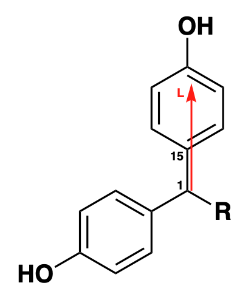
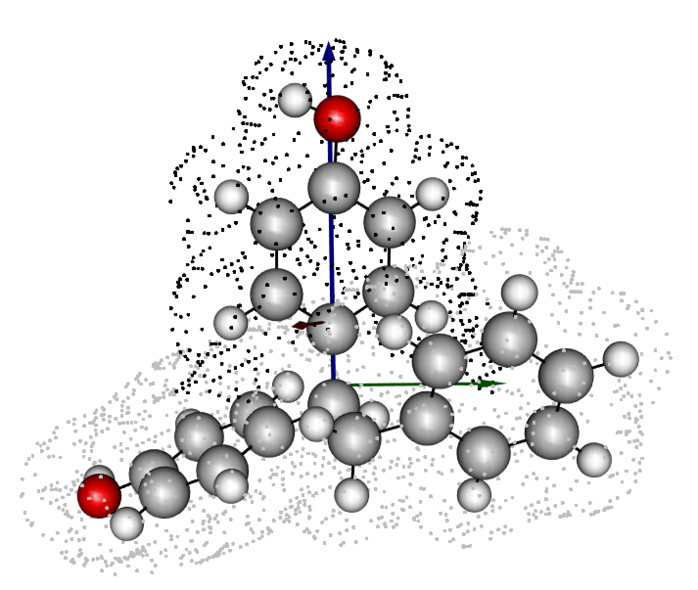

# Cube Functions

***

## Download example cube files

Please find the example cube files on the package's [Github](https://github.com/barkais/moleculaR/blob/main/Cube%20Functions/Example_cube_files.zip)

Once downloaded and unzipped, you are ready to go!

For user convenience, we demonstrate usage with a small number of molecules, such that downloading the log files directly to a local machine will stay within memory-usage reason. 

As with other cases of 3D visualizations in moleculaR, the 3D visual tool that is supplied by `steRimol.cube()` is hard to use on Linux systems without sudo access. Though this shouldn't prevent users from running this on Linux systems, just that visualizations are not guaranteed to work smoothly. 

> **Using cube functionalities requires setting the working directory to that holding at least one cube file. In cases where more than file is to be analyzed, all files should be in the same loctaion.**

***

```
# Load moleculaR
library(moleculaR)

# Set you working directory to that of the cube files
setwd('path/to/cube/files')
```

The generation of sterimol values from density cube files is similar in nature to the classic, xyz-based sterimol. The key difference between the two is the reliance of the classic computation on tabulated radii data, which do not account for stereo-electronic variations in atomic radii. Thus, by using tabulated data, one assumes that the changing electronic structure of the molecule, does not affect the atomic radii, which is not accurate, to say he least.   

The cube based sterimol tool seeks to face this issue by achieving a more subtle representation of sterimol values - with this, even values of unchanged substructures in two different molecules, will show variation in results. 

For example, using the supplied cube files, measuring sterimol values using steRimol.xyz along the primary axis 1-15, yields the exact same results for B1, and very close results for B5 and L (that have slight variations caused by the non-subtle changes to the structures in optimization). This is due to the fact that the substructure that follows this primary axis is consistent in all of the molecules. **Usage of functions will be explained later on.**

<center></center>

```
# Make xyz files from cube files:
xyz.from.cube('Ad.cube')
xyz.from.cube('Bn.cube')
xyz.from.cube('Cy.cube')

# Measure sterimol values for primary axis 1-15
steRimol.xyz.multi('1 15', CPK = T)
```

Gives:

```
       B1_1 B5_1  L_1 loc.B5_1 loc.B1_1
Ad.xyz  1.7 3.28 7.04     4.06     3.22
Bn.xyz  1.7 3.26 7.03     4.07     3.22
Cy.xyz  1.7 3.23 7.03     4.10     3.22
```

Now do the same with steRimol.cube:

```
# Compute cube steRimols with:
steRimol.cube.df('1 15')
```

Which gives:

```
       B1     B5      L loc.B5 loc.B1 time.taken
Ad 1.6473 3.4252 6.9813 1.7597 3.1770     7.6715
Bn 1.6436 3.5738 7.2337 4.1364 1.8079     7.1501
Cy 1.6637 3.3260 6.9240 4.0382 1.2983     7.6851
```

With this logic, it actually makes sense to evaluate even the unchanged substructures of molecular libraries, as it depicts the subtleties in stereo-electronic variations due to changing substituents. 

**It is important to note that the steRimol.cube functionalities are left out of the moleculaR workflow, as they require users to generate cube files independently, and placing all of them in a designated folder, to prevent unnecessarily heavy file transfers.**

> **Isovalues:**
>
>
steRimol.cube searches for density regions within a certain range of densities, which essentially depend on what we, as users, define the radius to be. 
>
>Generally speaking, we found that a value of ~0.003 e^-^/bohr^3^ fits sterimol values using CPK radii, while a much higher value of ~0.035 e^-^/bohr^3^ fits with Pyykko's covalent radii. Users are incouraged to play around with isovalues, as we believe there is some chemical knowledge underlying these differences, which could be benefitial in the realm of mechanistic investigations and statistical analyses. 

## Extract steRimol.cube values for a single cube file

Using this functionality also allows the visualization of the chosen molecule and of the computed B1, B5 and L axes. 

```
# For example, extracting sterimol values for the file Bn.cube, along the axis of 1-3:
steRimol.cube(cubefile = 'Bn.cube',
              coordinates = '1 3')

# Actually implies:
steRimol.cube(cubefile = 'Bn.cube',
              coordinates = '1 3',
              only.sub = T, 
              drop = NULL,
              plot = T,
              degrees = 90,
              isovalue = 0.003)
```

Gives:

```
      B1     B5      L loc.B5 loc.B1 time.taken
1 1.7405 6.0796 4.4315 3.2115 1.9695     7.1286
```

Using `plot = T` also produces a 3D visualization of the molecule:

<center></center>

* The dots around the molecule are coordinates in which electron density is in the range from the defined isovalue + 10%. Black painted dots imply the substructure designated by `sub_only = T`, while gray dots are the rest. 

* Sterimol axes are added as arrows - blue (L), green (B5), and red (B1).

* The `degrees` argument is changeable, but there is no benefit in changing it, rather it is there to ease validations. It is set to 90 degrees as this is a full 360˚ scan (to the degree), as with each 1 degree rotation, all 4 directions are accounted for. It is advised to use the default value. 

* The rest of the arguments are used exactly as with the classic `steRimol.xyz` and `steRimol` families. 

## Extracting steRimol.cube values for a set of cube files

For example, using the cube files we have, producing steRimol.cube values along the axis of 1-2:

```
steRimol.cube.df('1 2')
```

Gives:

```
       B1     B5      L loc.B5 loc.B1 time.taken
Ad 3.1523 3.7729 6.5829 4.0966 0.2460     8.7802
Bn 1.7405 6.0796 4.4315 3.2115 1.9695     6.8076
Cy 2.0178 3.7576 6.4470 3.9580 1.0763     8.3365
```

Visualization is not available for multiple files. To add visualization, first use the single file functionality. 

## Generating an xyz from a cube file 

A simple function, needed for different reasons. Existing xyz files will be removed by `steRimol.cube()` and `steRimol.cube.df()` once executed.

```
xyz.from.cube(cube_file)
```
