**It is highly recommended to begin by running the following example hand-in-hand with this guide**

## Download example log files

Please find the example log files on the package's [Github]('https://github.com/barkais/moleculaR/blob/main/Examples/Example_log_files.zip')

Once downloaded and unzipped, you are ready to go!

For user convenience, we demonstrate usage with a small number of molecules, such that downloading the log files directly to a local machine will stay within memory-usage reason. As stated on the home page, it is generally not the case. 

## Run extRactoR (while in the directory with the .log files)

```{r ex, eval=FALSE}
# While in a directory with the log files you wish to analyze - Run extractoR
extractoR()
```

This is the slowest part of the process and it takes a few seconds
per molecule.

Once done, you will receive a message on your console:

`Done!`

##### This is the folder you should transfer to your local (assuming you wish to run locally).

## Run unwRapper

```{r un, eval=FALSE}
# Run unwRapper (choose the directory with the feather files)
unwRapper()
```

#### Choose the location of the .feather files directory

<center>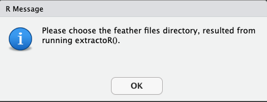</center>

**As long as you allowed extRactoR do what it wanted, you will only need to confirm your location**

#### unwRapper's message

Running `unwRapper` results in the creation of two new folders

<center>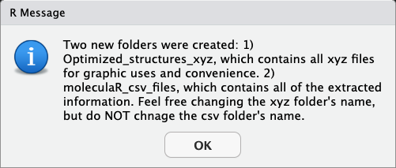</center>

Once finished, the function suggests to change your working directory. It is recommended to allow. 

<center>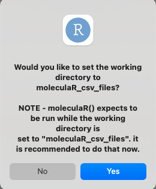</center>

**If you do not allow - note that you will have to in order to work with `moleculaR()`**

## Run moleculaR

Assuming everything went fine, and your working directory is set to *moleculaR_csv_files*

```{r mol, eval=FALSE}
# Run moleuclaR 
moleculaR()
```

<center></center>

**Users are then presented with the option to quit, and to generate a 3D visualization of one of**
**the molecules in the set. It is crucial you have such a visualization, whether you choose to use a different**
**software or moleculaR's `plot_molecule`**

<center>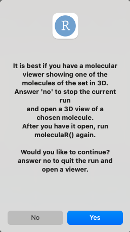</center>

For instance, in the presented example, we have chosen to visualize *Et.xyz* from the *Optimized_structures_xyz* folder. 
This image will serve us in answering moleculaR's questions - as the entire process depends on atom indexing.

<center>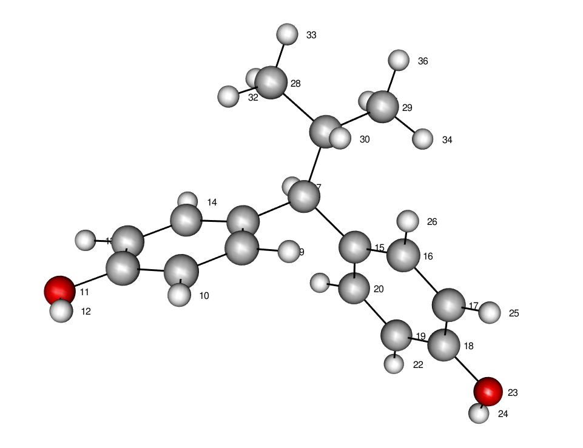</center>

## Features

**For each possible feature, you will be asked if you would like to use it. In cases where you choose not to,**
**the program will move on to the next feature. The guide assumes answers to be yes, and excludes the quetion windows.** 

Each of the features and their options are depicted in detail in `Features - Definitions and Practice`.


#### steRimol - B5, B1, L, loc.B1 and loc.B5 (the location of B1 and B5 vectors along the primary axis L)

<center></center>

There are two radii systems implemented in this version, the first being Pyykko's [covalent radii]('https://pubs.acs.org/doi/pdf/10.1021/jp5065819') and the second being CPK (VDW radii). The default is set to covalent radii as it holds a definituve value for all elements of the periodic table, while CPK is only defined for a small subset of them.

<center></center>

Should steRimol account for parts of the molecule that are not an extension of the primary axis? Namely, steRimol uses a graph-based "cut" of atoms that are not directly bonded to the defining axis. This is set to default as it is the generl case.

<center>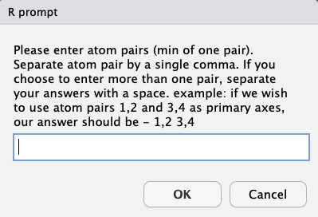</center>

steRimol allows for the use of either a singal primary axis or several primary axes simultaneously:

User should input primary axis atoms separated by a comma, and different primary axes separated by a space. 
  
For instance, in this example, we can imagine a scenario in which bonds 1-2, 1-3 and 1-15 can be of interest, so our answer    should be _1,2 1,3 1,15_ 

#### NBO (or NPA) charges - atomic values and differences 

<center></center>

Simple usage, with hardly any explanation needed. answers should be atoms separated by a comma. 

In cases where user chooses to use NBO charges, they will be preseted with the option to also use the difference in charge between atoms. 

<center></center>

<center>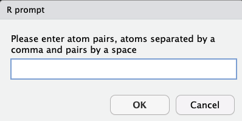</center>

Answers should be pairs of atoms, with each pair of atoms separated by a comma, and a space between different pairs.

#### Dipole moments - Directly extracted from Gaussian or manipulated

Possible manipulations include:

  1. Change of coordinate system - dipole's vector components with respect to a coordinate system of choice allows the use of the dipole's components as [independent features]("https://www.nature.com/articles/s41557-019-0258-1")
  
  2. Given that the coordinate system was changed - should the origin be the center of mass of a subset of atoms (user defined)? This classifies as an esoteric use, and is recommended to use with attention to definitions.
  
  3. Given That the coordinate system was changed, and that option 2 wasn't used - should the origin of the coordinate system be the center of mass of the "basic" structure? This classifies as an esoteric use, and is recommended to use with attention to definitions.
  
  In most cases - the coordinate system will be changed, but options 2 and 3 will be left out. 

Assuming users wish to use the dipole moment as a feature, they will be presented with the option to manipulate it:

<center></center>

Answering "no" will leave the original dipole moment, as it given in Gaussian, which means taken with respect to the molecule's center of mass (serving as the origin). 

It is stated that this is a must in case you wish to use any of the options, as they require the transformation of coordinate systems. the y axis and the xy plane will remain as user defines them, while the only thing changing is the origin. 

answering "yes" will generate the prompt

<center>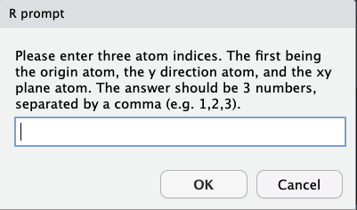</center>

answers are given in one of two forms:

  1. 3 atoms, separated by a comma - define: 
          
        i) atom 1 - the origin 
        ii) atom 2 - the y direction
        iii) atom 3 - the xy plane
          
  2. 4 atoms, separated by a comma - define:
  
        i) atoms 1 and 2  - center point between the two is the origin 
        ii) atom 3 - the y direction
        iii) atom 4 - the xy plane

Following the definition of coordinate system, user is prompted with:

<center></center>

**Which, in case answered "yes" will request the user to define:**

<center>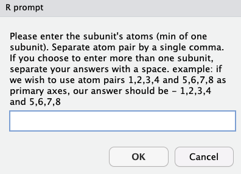</center>

This option allows the user to use several substructures as origins, while reatining the y diretion and xy plane definitions. To use one or more substructures, sets of atoms of each substructure should be separated by a comma, and different subsets should be separated by a space.   

**Otherwise, if user chooses to pass this option, another option will be presented:**

<center>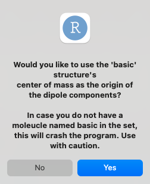</center>

**NOTE - this requires the presence of a file named basic.log, which can be whatever you find to be the "baseline" structure. it is usually the case that the smallest molecule that still holds the common substructure will serve as that structure** 

#### Vibrational Frequencies - Stretch, bend and ring vibrations

moleculaR includes the identification and extraction of vibrational frequencies that reoccur throughout sets of molecules. 

These include:
  1. Bonded atoms stretching vibrations
  2. Two characteristic ring vibrations (only for 6 member rings)
  3. Bending vibrations of two atoms that share a center atom (mostly hydrogens)

##### Bond Stretch

<center></center>

User should enter pairs of atoms, with pair atoms separated by a comma and different pairs separated by a space. 
Note that atoms must be bonded, and that submitting non-bonded atoms will crash the program with an error message. 

##### Ring Vibrations 

Ring vibrations are defined with the ring's six atoms, in an ordered fashion. 

<center>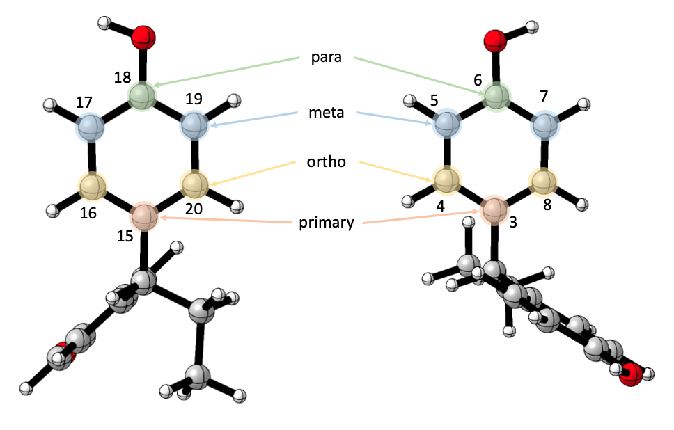</center>

Users arbitrarily choose a "primary" atom - it is most convenient to choose the first atom on the ring, that connects the ring to the common substructure, though it really doesn't matter. Once this atom is defined, the rest are relative to it, the one directly opposite to it is the "para" atom, the two next to is are the "ortho" atoms, and the rest are the "meta" atoms. 

<center>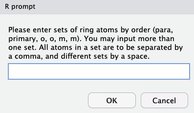</center>

Note that it is possible to extract vibrations for as many rings as they wish, with similar rules on input as before - same ring atoms, by the defined order, separated by a comma, and different rings separated by a space. 

In this instance, our answer would have been _6,3,4,8,5,7 18,15,16,20,17,19_ with _6,3,4,8,5,7_ for the ring on the right, and _18,15,16,20,17,19_ for the ring on the left.

**Be patient and make sure you do this correctly, as series that break this rule will work, but will produce wrong results. **

##### Bending Vibrations 

<center>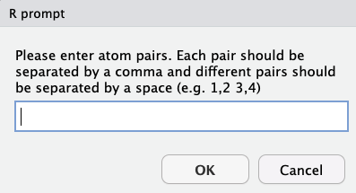</center>

User should enter pairs of atoms, with pair atoms separated by a comma and different pairs separated by a space. 
Note that atoms must share a center atom (both bonded to it), and that submitting non-bonded atoms will crash the program with an error message. 


#### Angles

answers are given in one of two forms:

  1. 3 atoms, separated by a comma - define an angle created between 3 atoms
          
  2. 4 atoms, separated by a comma - define a dihedral between two bonds
  
Users may insert as many triads/quartets as they wish.

<center>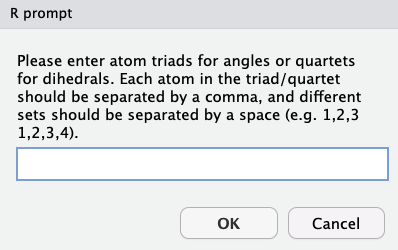</center>
  
#### Distances (or bond lengths)

Same rules for input as most prompts - pairs of atoms separated by a comma, and different pairs by a space. 

<center>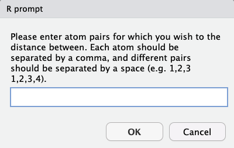</center>

#### Polarizabilities 

A simple "yes" or "no" - if answered "yes", will extract iso- and anisotropic polarizabilities. 

<center></center>

## Producing Results

moleculaR will note it is done with its request to name the output file, followed by choosing the location in which you want to save both the output and the resulting inputs file - which can be used in future extractions. 

<center></center>
<center></center>

#### Inputs file 

The inputs file is saved in a .RData format, which is only readable using R. To see its contents (and for advanced use - edit it for different uses) use `readRDS()`. 

```
$steRimol
$steRimol$input.vector
[1] "1 2" "1 3"

$steRimol$CPK
[1] FALSE

$steRimol$only.sub
[1] TRUE


$NBO
$NBO$atom_indices
[1] "1 2 3 15"

$NBO$difference_indices
[1] "1 2 1 3 1 15"


$Dipole
$Dipole$coor_atoms
[1] "1 2 3"

$Dipole$center_of_mass
[1] FALSE

$Dipole$center_of_mass_substructure
[1] FALSE

$Dipole$subunits_input_vector
NULL


$`Bond Vibs`
$`Bond Vibs`$atom_pairs
[1] "1 27"


$`Ring Vibs`
$`Ring Vibs`$inputs_vector
[1] "6 3 4 8 5 7"


$`Bend Vibs`
[1] NA

$Angles
$Angles$inputs_vector
[1] "4 3 1 2"


$Distances
[1] NA

$Polarizability
$Polarizability$polariz.answer
[1] "yes"

```
