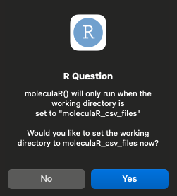
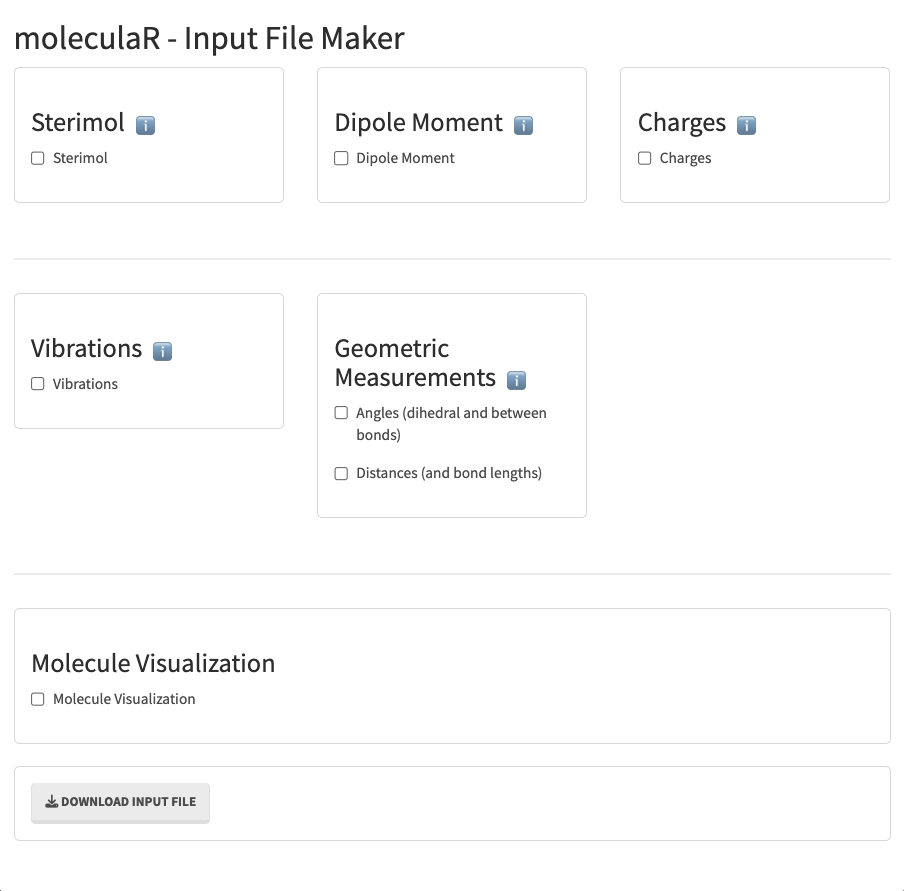
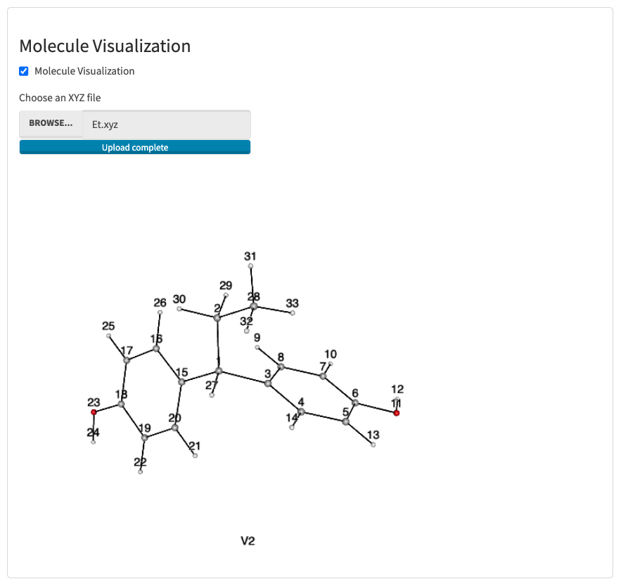

**It is highly recommended to begin by running the following example hand-in-hand with this guide**

## Download example log files

Please find the example log files on the package's [Github]('https://github.com/barkais/moleculaR/blob/main/Examples/Example_log_files.zip')

Once downloaded and unzipped, you are ready to go!

For user convenience, we demonstrate usage with a small number of molecules, such that downloading the log files directly to a local machine will stay within memory-usage reason. As stated on the home page, it is generally not the case. 

## Run extRactoR (while in the directory with the .log files)

```r
# While in a directory with the Gaussian log files you wish to analyze - Run extractoR
extractoR()
```

This is the slowest part of the process and it takes a few seconds
per molecule.

Once done, you will receive a message on your console:

`Done!`

##### This is the folder you should transfer to your local (assuming you wish to run locally).

## Run unwRapper

```r
# Run unwRapper (choose the directory with the feather files)
unwRapper()
```

#### Choose the location of the .feather files directory

<center></center>

#### unwRapper's message

Running `unwRapper` results in the creation of two new folders

The default name for the xyz files' folder is "Optimized_structures_xyz". Users can choose a different name by clicking 'No'.

<center></center>

The default name for the xyz files' folder is "Optimized_structures_xyz". Users can choose a different name by clicking 'No', which leads them to the input line:

<center></center>

Once finished, the function suggests to change your working directory. It is recommended to allow. 

<center></center>

**Note that you will have to set the working directory in order to work with `moleculaR()`**

## Run moleculaR.Input.Maker

Assuming everything went fine, and your working directory is set to *moleculaR_csv_files*

```r
# Run moleuclaR.Input.Maker
moleculaR.Input.Maker()
```

<center></center>

**Users can generate a 3D visualization of one of the molecules in the set, using the built-in molecular visualization.**
**Feature extraction relies on atom indices, and it is therefore important to have such a visualization open while preparing the input file.**


<center></center>

For instance, in the presented example, we have chosen to visualize *Et.xyz* from the *Optimized_structures_xyz* folder. 

## Features

Each of the features and their options are depicted in detail in `Features - Definitions and Practice`.


#### steRimol - B5, B1, L, loc.B1 and loc.B5 (the location of B1 and B5 vectors along the primary axis L)

<center></center>

**Sterimol - options**

*Axis or axes*

Two atom indices that define the primary axis for sterimol features. Users can apply sterimol to multiple axes at the same time by separating axis pairs as instructed. 

*Radii*

There are two radii systems implemented in this version, the first being CPK (VDW radii), and the second being Pyykko's [covalent radii]('https://pubs.acs.org/doi/pdf/10.1021/jp5065819').

*Only substituent* 

Should steRimol account for parts of the molecule that are not an extension of the primary axis? Namely, steRimol uses a graph-based "cut" of atoms that are not directly bonded to the defining axis. This is set to default as it is the generl case.

*Drop*

Users can define atoms that should be avoided during sterimol computation. This is relevant in cases where users wish to measure a substituent that holds a large moiety that takes over in B5 or L calculation, while there is a subunit of interest that is not rperesented. 

#### Dipole moments

<center></center>

Possible manipulations include:

  1. Change of coordinate system - the dipole vector components taken with respect to a coordinate system of choice allows the use of the dipole components as [independent features]("https://www.nature.com/articles/s41557-019-0258-1")
  
  2. Upon chnaging the coordinate system - the origin can be defined as either a single atom or the centeroid of a subset of atoms (user defined).


In case users wish to use the dipole moment as is (Gaussian's vector), inputs can be left empty.

answers should be given in one of two forms:

  1. 3 atoms, separated by a comma - define: 
          
        i) atom 1 - the origin 
        ii) atom 2 - the y direction
        iii) atom 3 - the xy plane
          
  2. multiple atoms, separated by a comma - define:
  
        i) atoms 1 to two before last  - centroid of this set is the origin 
        ii) one before last - the y direction
        iii) last - the xy plane

Users can apply this to multiple coordinate systems at the same time by separating sets of indices as instructed. 

#### Charges - atomic values and differences 

<center></center>

Answers should be atom indices separated by a comma. 

In cases where user chooses to use charges, they will be preseted with the option to also use the charge difference between atoms. 

There are three charge models implemented. Users can apply all three at the same time. 

#### Vibrational Frequencies - Stretch, bend and ring vibrations

<center></center>

moleculaR includes the identification and extraction of vibrational frequencies that reoccur throughout sets of molecules. 

These include:
  1. Bonded atoms stretching vibrations
  2. Two characteristic ring vibrations (only for 6 membered rings)
  3. Bending vibrations of two atoms that share a center atom (relevant for terminal atoms)

##### Bond Stretch

User should enter pairs of atoms, with pair atoms separated by a comma and different pairs separated by a space. 
Note that atoms must be bonded, and that submitting non-bonded atoms will crash the program with an error message. 

##### Ring Vibrations 

Ring vibrations are defined with the ring's six atoms, in an ordered fashion. 

<center></center>

Users arbitrarily choose a "primary" atom - it is most convenient to choose the first atom on the ring, that connects the ring to the common substructure though it really doesn't matter. Once this atom is defined, the rest are automatically assigned.

Note that it is possible to extract vibrations for multiple rings, following the instructions. 

In the example, our answer would have been _3 15_ with _3_ for the ring on the right, and _15_ for the ring on the left.

##### Bending Vibrations 

User should enter pairs of atoms, with pair atoms separated by a comma and different pairs separated by a space. 
Note that atoms must share a center atom (both bonded to it), and that submitting non-bonded atoms will crash the program with an error message. 


#### Goemetric Features

<center></center>

*Angles or dihedrals*

answers are given in one of two forms:

  1. 3 atoms, separated by a comma - define an angle created between 3 atoms
          
  2. 4 atoms, separated by a comma - define a dihedral between two bonds
  
Users may insert as many triads/quartets as they wish.
  
*Distances (or bond lengths)*

Same rules for input as most prompts - pairs of atoms separated by a comma, and different pairs by a space. 

#### Input file download

<center></center>

## Run moleculaR (while in the moleculaR_csv_files directory)

Pass the input file location as the argument to `moleculaR()`

```r
# While in the moleculaR_csv_files directory
moleculaR('location/of/Input_file.txt')
```
This will run the requested calculations, and will end with a prompt asking to name the results file. 

<center></center>

#### Input file 

The inputs file is saved in a .txt format.

<center></center>
