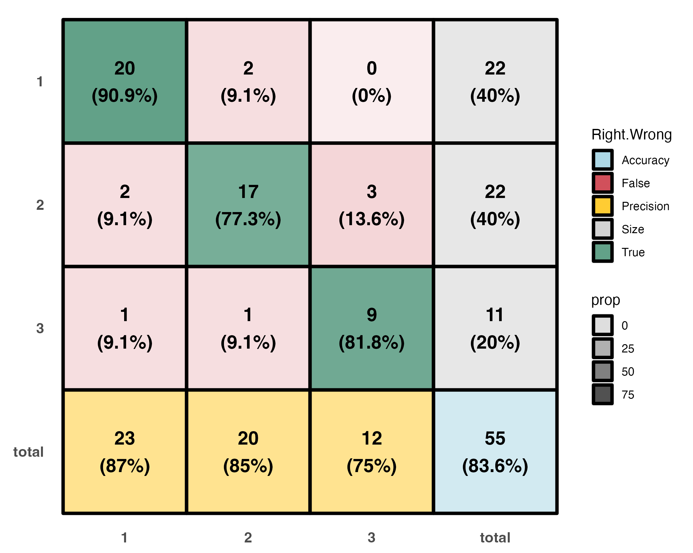
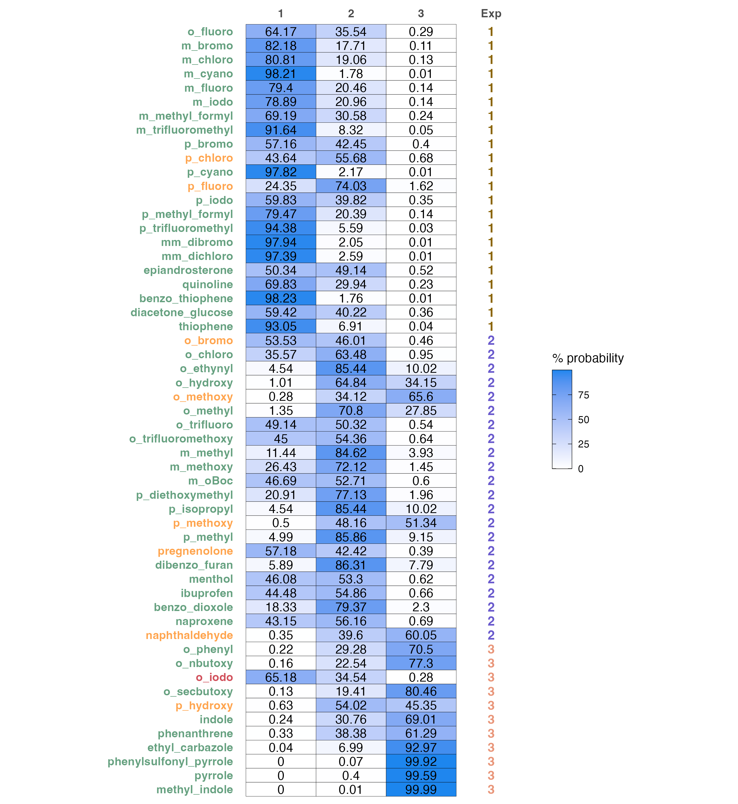
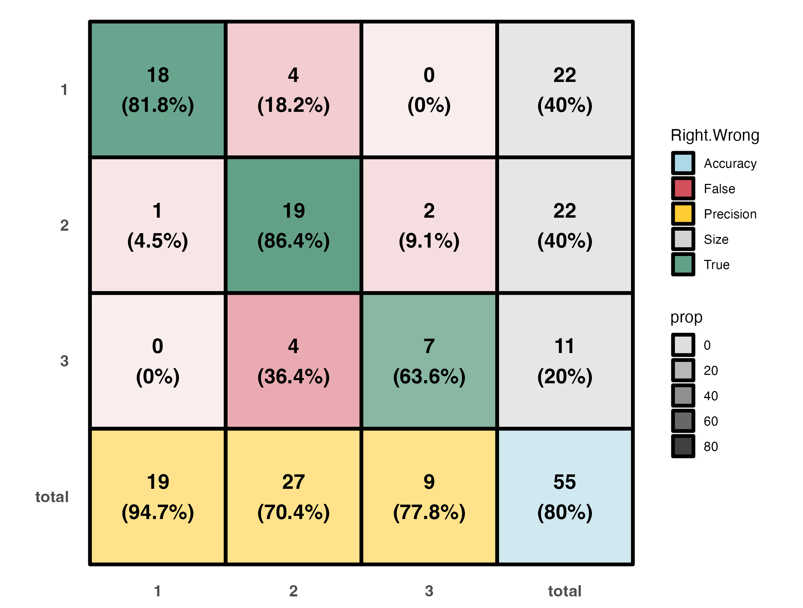
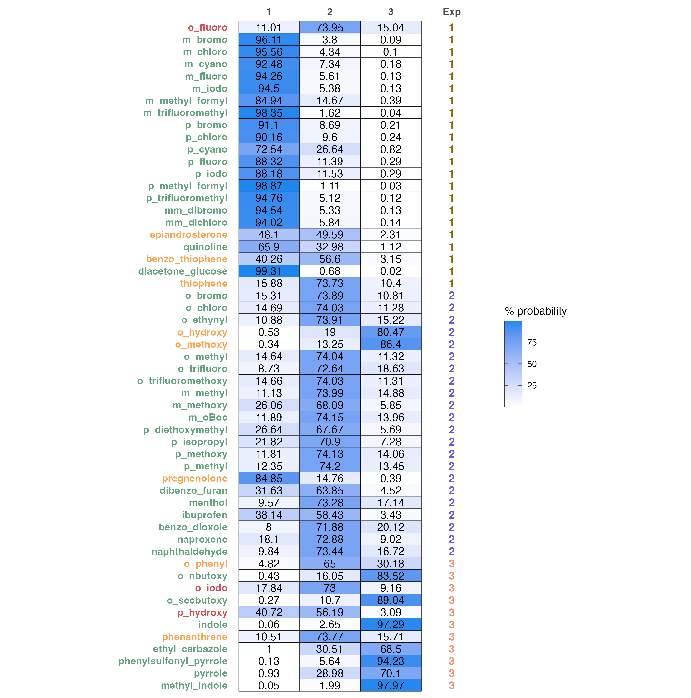
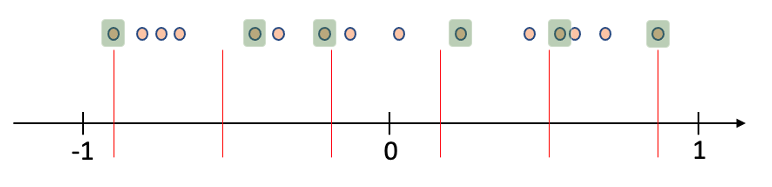

# Modeling - Under development

```r
library(moleculaR)
```

***

moleculaR offers a few easy-to-use and useful functionalities for the development and visualization of structure-activity relationship models  

>**This guide includes examples for both linear regressions and logistic regressions.**
>
>**For both parts, it first introduces the underlying mechanics, which are followed by the main user functions - `model.report()` and `model.report.logistic()` / `model.report.log.ordinal()`.**

Please find the [linear regression](https://github.com/barkais/moleculaR/blob/main/Modeling/Linear_Dataset_Example.csv) <sup>1</sup> and the [logistic regression](https://github.com/barkais/moleculaR/blob/main/Modeling/Logistic_Dataset_Example.csv) <sup>2</sup> example data sets on the package's Github

***

## Linear Regressions

>**Before you begin, check out the example data and its structure. Especially note the 'output' column. This is exactly how any data fed into the following functions should look like.**

### Feature Subsets and Model Ranking

`model.subsets()` presents a brute force feature selection algorithm, based on a K-fold cross validation Q<sup>2</sup> ranking. It computes all possible models with a user defined range of features, returning the top ranking models. 

To use the function, data must be a numeric data frame that is loaded into the global environment (data argument). Data must also have the **last** column holding the experimental observations (this is crucial for a smooth work experience).


For a minimal case usage, with no changes made to defaults - `model.subset()` will search for all possible models with 2 variables and up to the number of samples divided by 5. It will then retain models with R<sup>2</sup> above the `cutoff` (If there are any. If not, it will lower the cutoff down.) and pass them through a `folds` CV, which defaults to leave-one-out. The cross terms option adds all `:` interactions between variables - it is highly recommended to avoid it in cases with a lot of variables. 

```r
### Function structure ###

model.subset(
  data,
  out.col = dim(data)[2],
  min = 2,
  max = floor(dim(data)[1]/5),
  folds = nrow(data),
  iterations = 1,
  cutoff = 0.85
)
```

In R or RStudio console:

```r
### Minimal (default) usage ###

# Load data
data <- data.frame(data.table::fread('path/to/downloaded/Linear_Dataset_Example.csv'))

# Assuming the first column of data is molecule names
row.names(data) <- data[, 1]

# Remove after assigning row names
data <- data[, -1]

# Run model.subset
models <- model.subset(data = data)
```

This returns all models above R<sup>2</sup> = 0.85:

Note the assignment of results to a variable named 'models', which is recommended for later use of `model.plot()`.

```r
models
                                               formula      R.sq      Q.sq        MAE Model
1      `output` ~ `Dist.10..17.` + `Total` + `NBO.B.2` 0.9183105 0.8638877 0.06189765     1
2   `output` ~ `Total` + `diff.B2.O9` + `diff.H10.O17` 0.8805636 0.8076407 0.07157056     2
3 `output` ~ `Dist.16..17.` + `Total` + `diff.H16.O17` 0.9020966 0.7913756 0.07490688     3
4 `output` ~ `Dist.10..17.` + `Total` + `diff.H16.O17` 0.8606321 0.7632980 0.08346307     4
```

### Model Plot

To produce a nice, yet minimal plot of the linear model, with predicted values vs. measured ones, use `model.plot()`. Assuming the user saved `model.subset()`s result with 'models', `model.plot()` will default to plot the highest ranking model.
```r
### Function Structure ###
model.plot(model = models[1, 1], data)
```

In R or RStudio console:

```r
# Produce plot (default)
model.plot(data = data)
```

The names (the first column) in the data have a clear indication of substituent location on a ring, which is as follows

  * o_ for 2 and 6 substituted rings
  * m_ for 3 and 5 substituted rings
  * p_ for 4 substituted rings
  * oo_for 2,6 substituted rings and mm_ for 3,5 substituted rings
  * om_ / op_ / mp_ for 2,3 / 2,4 / 3,4 substituted rings
  * In any other case, it is advised to avoid the naming system, and stick with the default grey color

This is useful in cases where the changing substitution pattern involves a ring (which are very common). The function translates these, and indicates them with color - red being ortho, yellow being meta and green being para.

The plot also includes a prediction band, marked as dotted blue lines.

The resulting plot:

<center></center>

### Model Report

**Designed as the main function for linear modeling purposes.**

Produce a complete report for a data set (csv file), and a chosen model.

This is a wrapper function that uses both `model.subset()` and `model.plot()` under the hood, which also includes a 3 and 5 fold CV, as well as a LOOCV. The function also adds the model formula and stats to the plot. 

In addition to default usage, the function also allows for outliers handling and out-of-sample predictions to be considered. To do so, users should indicate the names of sample as they appear in the original data (e.g. 'p_F' or c('p_F', 'm_Me')) in the `leave.out` argument. By indicating `predict` as `TRUE`, they will be treated as out-of-sample predictions. 

```r
### Function Structure ###
model.report(
  dataset,
  min = 2,
  max = floor(dim(mod_data)[1]/5),
  leave.out = "",
  predict = F
)
```

Normal usgae, for our example file:

```r
model.report('path/to/Linear_Example_Dataset.csv',
             min = 3,
             max = 3,
             leave.out = c('p_F', 'm_Me'),
             predict = T)
```

First produces `model.subset()` results, and prompts for the model (number) you wish to plot and report.

* showing only the 4 top ranked
```r
Linear_Example_Dataset

|formula                                              |      R.sq|      Q.sq|       MAE| Model|
|:----------------------------------------------------|---------:|---------:|---------:|-----:|
|`output` ~ `Dist.10..17.` + `Total` + `NBO.B.2`      | 0.9580530| 0.9183570| 0.0514160|     1|
|`output` ~ `Total` + `diff.B2.O9` + `diff.H10.O17`   | 0.9063088| 0.8424013| 0.0692448|     2|
|`output` ~ `Dist.16..17.` + `Total` + `diff.H16.O17` | 0.9244792| 0.8252764| 0.0720359|     3|
|`output` ~ `Dist.10..17.` + `Total` + `diff.H16.O17` | 0.8987248| 0.7797936| 0.0777995|     4|

```

After answering the prompt '1' (in the console):

* Note the out-of-sample (OOS) result

```r
Choose the model you would like to plot (line number): 1

  Model Coefficients

|             |   Estimate| Std. Error|    t value|  p value|
|:------------|----------:|----------:|----------:|--------:|
|(Intercept)  |  0.7753622|  0.0144429|  53.684790| 0.00e+00|
|Dist.10..17. | -0.2669203|  0.0191554| -13.934442| 2.00e-07|
|Total        | -0.1902052|  0.0184609| -10.303131| 2.80e-06|
|NBO.B.2      | -0.1303210|  0.0155032|  -8.406052| 1.49e-05|

  3-fold CV

|        Q2|       MAE|
|---------:|---------:|
| 0.8651927| 0.0721472|

  5-fold CV

|        Q2|       MAE|
|---------:|---------:|
| 0.9002753| 0.0582111|


|     |  OOS Pred| OOS Measured|
|:----|---------:|------------:|
|m_Me | 0.8609255|    0.7118072|
|p_F  | 0.9067790|    0.8293038|

  Unnormalized Data Model Coefficients

|             |     Estimate| Std. Error|    t value|  p value|
|:------------|------------:|----------:|----------:|--------:|
|(Intercept)  |  152.3573140| 19.8007301|   7.694530| 9.40e-06|
|Dist.10..17. |  -10.2407833|  0.9469590| -10.814390| 3.00e-07|
|Total        |   -0.1835649|  0.0229566|  -7.996163| 6.60e-06|
|NBO.B.2      | -108.4088125| 16.3732877|  -6.621078| 3.76e-05|
```

And the produced plot:

<center></center>

## Logistic Regressions

>**Before you begin, check out the example data and its structure. Especially note the 'flag' and 'class' columns. This is exactly how any data fed into the following functions should look like.**

moleculaR comes with two applicable routs for classifications tasks using logistic regressions:
  
  * Multinomial Logistic Regression (MLR)
  * Ordinal Multinomial Logistic regression (OMLR)
  
**This guide will use OMLR as an example. All methods presented using the `.log.ordinal` functions family have a parallel `.logistic` function. **

### Feature Subsets and Model Rankings

Similarly to `model.subset()` used in linear modeling, classification models are screened and ranked using the `model.subset.log.ordinal()` and `model.subset.logistic()` functions. 

To use the function, data must be a numeric data frame that is loaded into the global environment (data argument). Data must also have the a column holding the experimental observations (i.e. classes), that should be named 'class' (this is crucial for a smooth work experience). The data should also have a column named 'flag', which holds the sample number in the data (basically a row number). This is a must. 


For a minimal case usage, with no changes made to defaults - `model.subset.log.ordinal()` will search for all possible models with 2 variables and up to the number of samples divided by 5. It will then rank the models according to their McFadden pseudo R<sup>2</sup> <sup>3</sup>.


```r
### Function structure ###

model.subset.log.ordinal(
  data,
  out.col = which(colnames(data) == "class"),
  min = 1,
  max = floor(dim(data)[1]/5)
)
```

In R or RStudio console:

```r
### Minimal (default) usage ###

# Load data
data <- data.frame(data.table::fread('path/to/downloaded/Logistic_Dataset_Example.csv'))

# Assuming the first column of data is molecule names
row.names(data) <- data[, 1]

# Remove after assigning row names
data <- data[, -1]

# Factor the 'class' column (make categorical) 

data$class <- as.factor(data$class)

# Run model.subset, with min and max defining the range of allowed variables
models <- model.subset.log.ordinal(data = data, min = 3, max = 3)
```

Which returns:

```r
models
                                         formula McFadden R2
1         `class` ~ `X.2.3.` + `NPA_1` + `NPA_3`       0.543
2         `class` ~ `Total` + `NPA_1` + `loc.B5`       0.542
3      `class` ~ `Total` + `diff.1.2` + `loc.B5`       0.537
4   `class` ~ `X.2.3.` + `diff.1.2` + `diff.2.3`       0.532
5  `class` ~ `Dist.2..7.` + `NPA_3` + `diff.1.2`       0.530
6      `class` ~ `Total` + `diff.2.7` + `loc.B5`       0.525
7            `class` ~ `Total` + `B5` + `loc.B5`       0.525
8      `class` ~ `Total` + `diff.2.3` + `loc.B5`       0.524
9         `class` ~ `Total` + `NPA_3` + `loc.B5`       0.523
10         `class` ~ `dip_y` + `NPA_1` + `NPA_3`       0.520
```

### Model Summary

To perform a general summary of the model, users must first manually run and save the model, as the following functions expect a model object. 

**This step is a must in order to manually produce visualizations with `ct.plot()` and `prob.heatmap()`**

For OMLR - applying MASS::polr()
```r
# Define model formula
test.form <- models[1, 1] # This example uses the highest ranked model

# Just for order rename the data
test.data <- data

# Define the start argument, see ?MASS::polr() for furthe explanations
num.of.vars <- stringi::stri_count(test.form, fixed = '+')
start <- c(rep(0, num.of.vars + 2), 1)

# Run the model, here named test
test <- MASS::polr(test.form,
                   data = test.data,
                   Hess = T, start = start)
```

And for MLR - applying nnet::multinom
```r
# Define model formula
test.form <- models[1, 1] # Assuming model.subset.logistic() was first run

# Just for order rename the data
test.data <- data

# Run the model, here named test
test <- nnet::multinom(test.form,
                       data = test.data,
                       maxit = 2000, 
                       trace = F)
```

`test` is a model object, which can now be passed to `mod.info.log.ordinal()` or `mod.info.logistic()`. The data argument exceptsthe same data loaded for `model.subset.log.ordinal()`

```r
### Function Structure ###

mod.info.log.ordinal(model, data)
```

The function produces two results directly to the console

1. A table with the overall accuracy and the models pseudo R<sup>2</sup>.
2. A table with model coefficients.

But, more importantly, it saves a classification table (ct) to the variable it was assigned to (`test.info` in this example). This will be used later on. 
```r
test.info <- mod.info.log.ordinal(test, data)


|Accuracy |McFadden_R2 |
|:--------|:-----------|
|83.64%   |0.543       |


|         |        Value| Std. Error|       t value|
|:--------|------------:|----------:|-------------:|
|X.2.3.   |   -0.1784354|  0.0002283|     -781.4464|
|NPA_1    |   34.0676906|  0.0002289|   148862.4974|
|NPA_3    | -304.9960103|  0.0000620| -4916229.4879|
|1&#124;2 | -179.6183727|  0.0004239|  -423722.4302|
|2&#124;3 | -174.3768951|  0.6911103|     -252.3141|
```

### Visualizations 

**A color coded classification table. **

* Percentage within each of the main entries represents the recall (or its complimenting negative recall).
* Percentage in grey boxes represents the part a group takes out of the entire set.
* Percentage in yellow boxes is classification precision.
* Percetage in the blue box is the overall model accuracy.

```r
# Produce ct.plot
ct.plot(test.info)
```

Which gives:

<center></center>

**A color coded predictions and probabilities table. **

predicted probabilities of each sample to belong in a certain class and a comparison to the experimental result.
Sample name changes color according to the correctness of prediction:

* Green colored names are correct classifications
* Orange colored names are wrong classifications, where the second highest probability is the correct one
* Red colored names are wrong


```r
# Produce probabilities heatmap
prob.heatmap(test, data)
```

Which gives
<center></center>

### Model Report

**Designed as the main function for classification modeling purposes.**

Produce a complete report for a data set (csv file).

This is a wrapper function that uses all of the functions above under the hood, but also includes a smallest-group-size-fold CV, as well as a LOOCV. Produces visualizations and model summary automatically. Defaults to reporting the top ranked model, which is changeable with `model.number`.

```r
### Function Structure ###
model.report.log.ordinal(dataset,
                         min = 1,
                         max = (min + 1),
                         model.number = 1)
```

Normal usgae, for our example file(using min = max = 2)

```r
model.report.log.ordinal('path/to/Logistic_Dataset_Example.csv',
                         min = 2,
                         max = 2)
```

Produces

```r
Logistic_Dataset_Example

|formula                          | McFadden R2|
|:--------------------------------|-----------:|
|`class` ~ `Total` + `loc.B5`     |       0.490|
|`class` ~ `Total` + `Dist.2..3.` |       0.467|
|`class` ~ `X.2.3.` + `Total`     |       0.447|
|`class` ~ `Total` + `NPA_3`      |       0.447|
|`class` ~ `Total` + `L`          |       0.443|
|`class` ~ `Dist.2..7.` + `NPA_3` |       0.419|
|`class` ~ `X.2.3.` + `NPA_3`     |       0.416|
|`class` ~ `X.2.7.` + `NPA_3`     |       0.406|
|`class` ~ `NPA_3` + `diff.2.7`   |       0.404|
|`class` ~ `dip_y` + `NPA_3`      |       0.402|

  Leave-one-out Cross Validation - single iteration
      

|actual |  1|  2|  3|    |actual |  1|  2|  3|
|:------|--:|--:|--:|:---|:------|--:|--:|--:|
|1      | 18|  4|  0|*** |1      | 18|  4|  0|
|2      |  1| 19|  2|*** |2      |  1| 19|  2|
|3      |  0|  4|  7|*** |3      |  0|  4|  7|


|over.all.accuracy |best |worst |
|:-----------------|:----|:-----|
|80                |80   |80    |

  Smallest-group-fold Cross Validation (100 iterations)
  
  Classification tables for best (left) and worst (right) iterations. 
      

|actual |  1|  2|  3|    |actual |  1|  2|  3|
|:------|--:|--:|--:|:---|:------|--:|--:|--:|
|1      | 19|  3|  0|*** |1      | 18|  4|  0|
|2      |  1| 19|  2|*** |2      |  2| 18|  2|
|3      |  0|  4|  7|*** |3      |  0|  4|  7|


|over.all.accuracy |best  |worst |
|:-----------------|:-----|:-----|
|79.42             |81.82 |78.18 |

  Model Summary
      

|Accuracy |McFadden_R2 |
|:--------|:-----------|
|80%      |0.49        |


|         |      Value| Std. Error|   t value|
|:--------|----------:|----------:|---------:|
|Total    |  2.5067944|  0.4980471|  5.033248|
|loc.B5   | -0.4868867|  0.1408152| -3.457629|
|1&#124;2 |  5.5853729|  1.4951692|  3.735612|
|2&#124;3 |  9.4065888|  1.8281335|  5.145461|
```

As well as the plots in visualization, side by side (Now presented one below the other)

<center></center>

<center></center>

### Dealing with Unbalanced Data Sets

moleculaR also includes a cosine similarity based sampling function, that allows users to create well distributed subsets of classes. 

1.	For each class, a mean vector is computed and taken as the representative vector of that class. 

2.	For each sample in the set (a vector of features) the cosine of the angle between it and all representative vectors is computed. This step yields the similarity of that sample with each of the classes, including its own class. A value in the range of -1 to 1 is given as an indication of how well correlated the different entries of each vector with that of the representative (1 being completely correlated and -1 being anti-correlated). 


3.	Depending on the requested number of samples (N) to be taken and the class compared with, the range is equally divided to N-1 segments. The closest sample to each divider is sampled. This creates a well-distributed representative sample of the set. 

For example, in the following illustration, a sample of 6 representatives is taken from a set of observations. The similarity measurement can be either that of these data points with their own class, or with another class. The maximal and minimal similarity observations are always sampled, and the distance of all points from each divider (red lines) is measured, with the minimal value observations sampled (highlighted). 


<center></center>

As an example, consider balancing the data set we have, such that we will end with 11 samples of each group (size of the smallest group, also the default setting) 

```r
### Function Structure ###
simi.sampler(
  data,
  class,
  compare.with = 0,
  plot = F,
  sample.size = min(summary(as.factor(data$class)))
)
```
The function returns a vector of row numbers that represent the sampled subset. 

```r
# Load data
data <- data.frame(data.table::fread('path/to/downloaded/Logistic_Dataset_Example.csv'))

# Assuming the first column of data is molecule names
row.names(data) <- data[, 1]

# Remove after assigning row names
data <- data[, -1]

# Factor the 'class' column (make categorical) 

data$class <- as.factor(data$class)
```

As a start, we can sample out based on similarity of each group with itself (default, defined by `compare.with = 0`), with a sample size based on the smallest group (11).

* Change `class` to any one of the classes, and it will sample it.
* Change `compare.with` to any one the classes, and will perform based on similarity to that class. 

A nice plot is also available. 

```r
simi.sampler(data = data, class = 1, plot = T)

# Gives the vector of samples as output (row numbers to be sampled)

[1]  1  7  8 12 13 15 18 19 20 21 22
```

<center></center>

Note how group one is now down to 11 points, while still spread across the similarity measure range. 

