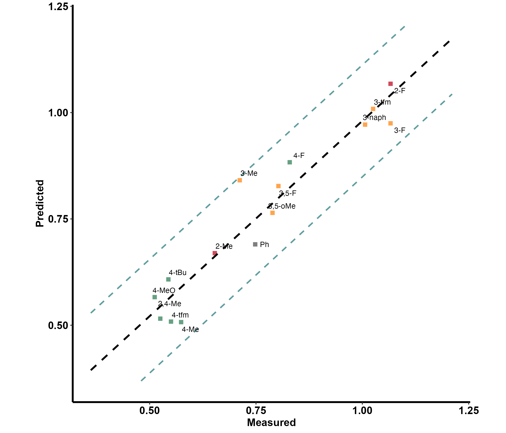
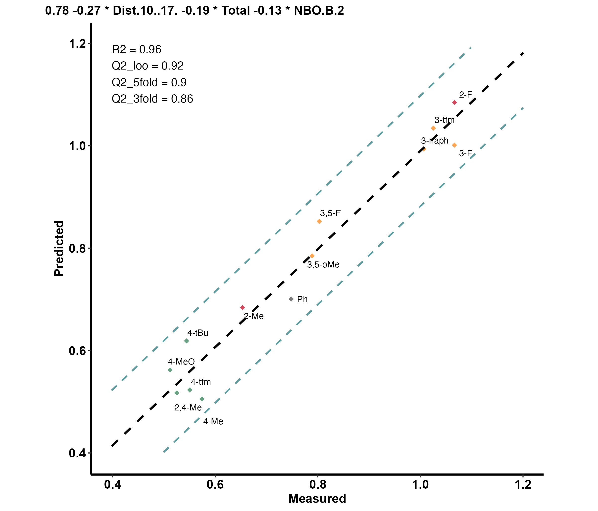
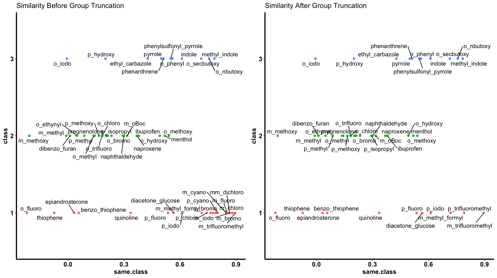

# Modeling - Under development

```r
library(moleculaR)
```

***

moleculaR offers a few easy-to-use and useful functionalities for the development and visualization of structure-activity relationship models  

>**This guide includes examples for both linear regressions and logistic regressions.**
>
>**For both parts, it first introduces the underlying mechanics, which are followed by the main user functions - `model.report()` and `model.report.logistic()` / `model.report.log.ordinal()`.**

Please find the [linear regression](https://github.com/barkais/moleculaR/blob/main/Modeling/Linear_Dataset_Example.csv) <sup>1</sup> and the [logistic regression](https://github.com/barkais/moleculaR/blob/main/Modeling/Logistic_Dataset_Example.csv) <sup>2</sup> example data sets on the package's Github

***

## Linear Regressions

>**Before you begin, check out the example data and its structure. Especially note the 'output' column. This is exactly how any data fed into the following functions should look like.**

### Feature Subsets and Model Ranking

`model.subsets()` presents a brute force feature selection algorithm, based on a K-fold cross validation Q<sup>2</sup> ranking. It computes all possible models with a user defined range of features, returning the top ranking models. 

To use the function, data must be a numeric data frame that is loaded into the global environment (data argument). Data must also have the **last** column holding the experimental observations (this is crucial for a smooth work experience).


For a minimal case usage, with no changes made to defaults - `model.subset()` will search for all possible models with 2 variables and up to the number of samples divided by 5. It will then retain models with R<sup>2</sup> above the `cutoff` (If there are any. If not, it will lower the cutoff down.) and pass them through a `folds` CV, which defaults to leave-one-out. The cross terms option adds all `:` interactions between variables - it is highly recommended to avoid it in cases with a lot of variables. 

```r
### Function structure ###

model.subset(
  data,
  out.col = dim(data)[2],
  min = 2,
  max = floor(dim(data)[1]/5),
  folds = nrow(data),
  iterations = 1,
  cutoff = 0.85
)
```

In R or RStudio console:

```r
### Minimal (default) usage ###

# Load data
data <- data.frame(data.table::fread('path/to/downloaded/Linear_Dataset_Example.csv'))

# Assuming the first column of data is molecule names
row.names(data) <- data[, 1]

# Remove after assigning row names
data <- data[, -1]

# Run model.subset
models <- model.subset(data = data)
```

This returns all models above R<sup>2</sup> = 0.85:

Note the assignment of results to a variable named 'models', which is recommended for later use of `model.plot()`.

```r
models
                                               formula      R.sq      Q.sq        MAE Model
1      `output` ~ `Dist.10..17.` + `Total` + `NBO.B.2` 0.9183105 0.8638877 0.06189765     1
2   `output` ~ `Total` + `diff.B2.O9` + `diff.H10.O17` 0.8805636 0.8076407 0.07157056     2
3 `output` ~ `Dist.16..17.` + `Total` + `diff.H16.O17` 0.9020966 0.7913756 0.07490688     3
4 `output` ~ `Dist.10..17.` + `Total` + `diff.H16.O17` 0.8606321 0.7632980 0.08346307     4
```

### Model Plot

To produce a nice, yet minimal plot of the linear model, with predicted values vs. measured ones, use `model.plot()`. Assuming the user saved `model.subset()`s result with 'models', `model.plot()` will default to plot the highest ranking model.
```r
### Function Structure ###
model.plot(model = models[1, 1], data)
```

In R or RStudio console:

```r
# Produce plot (default)
model.plot(data = data)
```

The names (the first column) in the data have a clear indication of substituent location on a ring, which is as follows

  * o_ for 2 and 6 substituted rings
  * m_ for 3 and 5 substituted rings
  * p_ for 4 substituted rings
  * oo_for 2,6 substituted rings and mm_ for 3,5 substituted rings
  * om_ / op_ / mp_ for 2,3 / 2,4 / 3,4 substituted rings
  * In any other case, it is advised to avoid the naming system, and stick with the default grey color

This is useful in cases where the changing substitution pattern involves a ring (which are very common). The function translates these, and indicates them with color - red being ortho, yellow being meta and green being para.

The plot also includes a prediction band, marked as dotted blue lines.

The resulting plot:

<center></center>

### Model Report

**Designed as the main function for linear modeling purposes.**

Produce a complete report for a data set (csv file), and a chosen model.

This is a wrapper function that uses both `model.subset()` and `model.plot()` under the hood, which also includes a 3 and 5 fold CV, as well as a LOOCV. The function also adds the model formula and stats to the plot. 

In addition to default usage, the function also allows for outliers handling and out-of-sample predictions to be considered. To do so, users should indicate the names of sample as they appear in the original data (e.g. 'p_F' or c('p_F', 'm_Me')) in the `leave.out` argument. By indicating `predict` as `TRUE`, they will be treated as out-of-sample predictions. 

```r
### Function Structure ###
model.report(
  dataset,
  min = 2,
  max = floor(dim(mod_data)[1]/5),
  leave.out = "",
  predict = F
)
```

Normal usgae, for our example file:

```r
model.report('path/to/Linear_Example_Dataset.csv',
             min = 3,
             max = 3,
             leave.out = c('p_F', 'm_Me'),
             predict = T)
```

First produces `model.subset()` results, and prompts for the model (number) you wish to plot and report.

* showing only the 4 top ranked
```r
Linear_Example_Dataset

|formula                                              |      R.sq|      Q.sq|       MAE| Model|
|:----------------------------------------------------|---------:|---------:|---------:|-----:|
|`output` ~ `Dist.10..17.` + `Total` + `NBO.B.2`      | 0.9580530| 0.9183570| 0.0514160|     1|
|`output` ~ `Total` + `diff.B2.O9` + `diff.H10.O17`   | 0.9063088| 0.8424013| 0.0692448|     2|
|`output` ~ `Dist.16..17.` + `Total` + `diff.H16.O17` | 0.9244792| 0.8252764| 0.0720359|     3|
|`output` ~ `Dist.10..17.` + `Total` + `diff.H16.O17` | 0.8987248| 0.7797936| 0.0777995|     4|

```

After answering the prompt '1' (in the console):

* Note the out-of-sample (OOS) result

```r
Choose the model you would like to plot (line number): 1

  Model Coefficients

|             |   Estimate| Std. Error|    t value|  p value|
|:------------|----------:|----------:|----------:|--------:|
|(Intercept)  |  0.7753622|  0.0144429|  53.684790| 0.00e+00|
|Dist.10..17. | -0.2669203|  0.0191554| -13.934442| 2.00e-07|
|Total        | -0.1902052|  0.0184609| -10.303131| 2.80e-06|
|NBO.B.2      | -0.1303210|  0.0155032|  -8.406052| 1.49e-05|

  3-fold CV

|        Q2|       MAE|
|---------:|---------:|
| 0.8651927| 0.0721472|

  5-fold CV

|        Q2|       MAE|
|---------:|---------:|
| 0.9002753| 0.0582111|


|     |  OOS Pred| OOS Measured|
|:----|---------:|------------:|
|m_Me | 0.8609255|    0.7118072|
|p_F  | 0.9067790|    0.8293038|

  Unnormalized Data Model Coefficients

|             |     Estimate| Std. Error|    t value|  p value|
|:------------|------------:|----------:|----------:|--------:|
|(Intercept)  |  152.3573140| 19.8007301|   7.694530| 9.40e-06|
|Dist.10..17. |  -10.2407833|  0.9469590| -10.814390| 3.00e-07|
|Total        |   -0.1835649|  0.0229566|  -7.996163| 6.60e-06|
|NBO.B.2      | -108.4088125| 16.3732877|  -6.621078| 3.76e-05|
```

And the produced plot:

<center></center>

## Logistic Regressions

See our independent package for logistic regression models development and visualization at [rxn.class.cond](https://github.com/barkais/rxn.cond.class/tree/main)

<center></center>

Note how group one is now down to 11 points, while still spread across the similarity measure range. 

